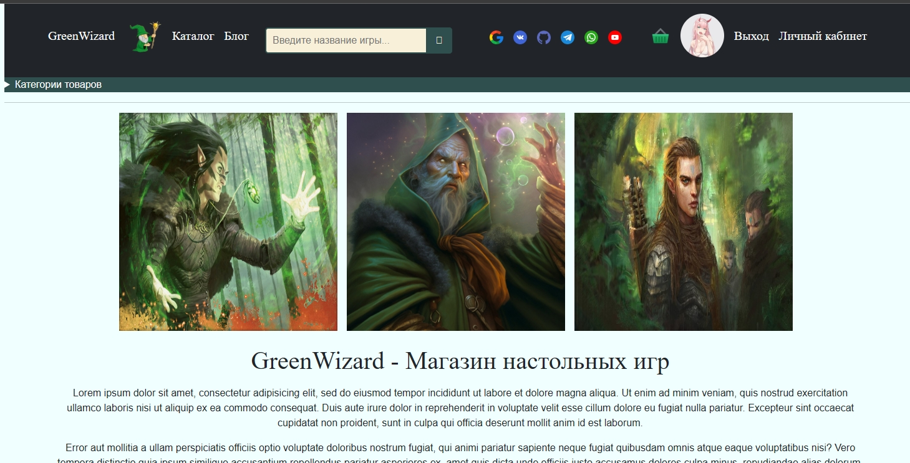
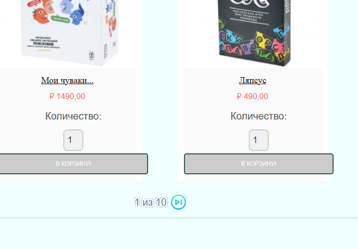
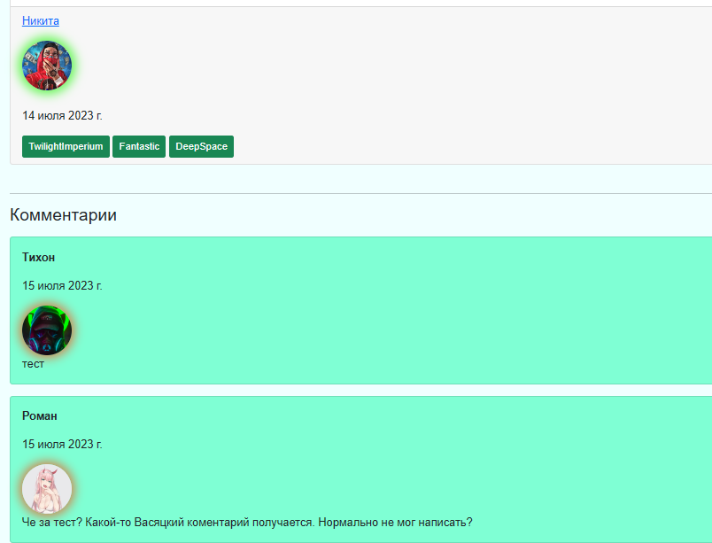
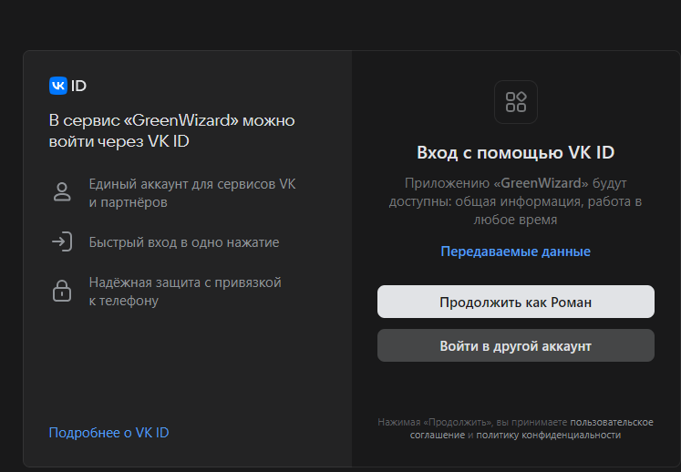
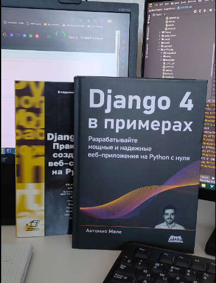
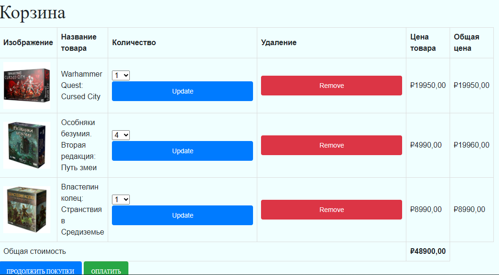
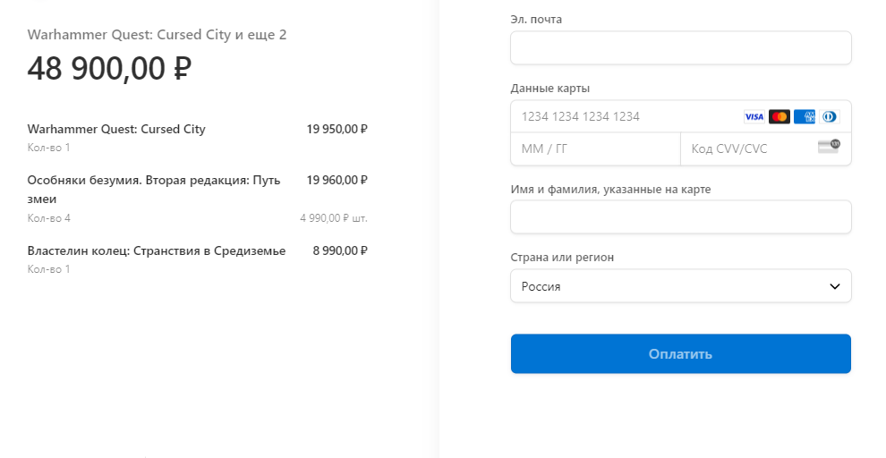
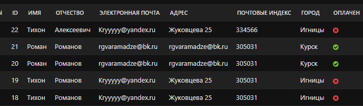

# GreenWizard

*Pet project, написанный на фреймворке Django 4.2 языка Python.*

## Цель проекта

Основной целью перед собой ставил разработку минимально жизнеспособного продукта в сегмменте e-commerce
решений, для того, чтобы отточить скиллы backend разработчика на фреймворке Django.
Фронтенду я не уделял пристальное внимание, но заострил внимание на бэкенд части.

Проект представляет собой интернет-магазин настольных игр, где есть следующие функциональные разделы:
* Каталог
* Блог
* Личный кабинет
* Корзина
* Заказы
* Оплата
* Фронтенд

Получается достаточно большой сайт с большим кол-вом **функциональных** моделуй, т.е. не 
наборы безжизненных html страниц, а отдельные веб-приложения.

Перед тем, как рассказать про все модули, немного расскажу процессе заполнения базы данных 
товарами.

### Создание проекта

Когда пришла идея делать интернет-магазин, я понял, что нужно собрать "нормальное"
кол-во товаров, чтобы разбить их по категориям и тегам, подлючить пагинацию и фильтрацию и т.д.

Мне нужно было быстрое решение, которое я мог бы собрать "на коленках".

Я решил спарсить сайт конкурентов! Не весь, 150 товарных позиций мне хватило.

    for i in range(1, 6):
        base_url = requests.get(f'https://hobbygames.ru/nastolnie?page={i}&parameter_type=0').text
        soup = BeautifulSoup(base_url, 'html.parser')
        div_elements = soup.find_all('div', class_='col-lg-4 col-md-6 col-sm-6 col-xs-12')

        for div in div_elements:
            title = div.find('a', class_='name')['title']
            duration_text = div.find('div', class_='params__item time').get('title')
            age_limit = div.find('div', class_='params__item age').get('title')
            number_of_persons = div.find('div', class_='params__item players').get('title')

Полный код в модуле game_parser/hobby_games)parsing.py

Решая эту задачу, удалось освежить и попрактиковать работу с библиотеками
**requests** & **bs4**, а также использовать **регулярные выражения** и кастомные приемы обработки и форматирования данных.

### Каталог

Чтобы не тратить лишнее время, сразу расскажу о функционале модуля.

1. Деление на категории
2. Деление на теги (с использованием модуля **taggit**)
3. Пагинация
4. Соритровки
5. Фильтры
6. Детальная карточка товара
7. Связанные игры
8. Поиск (на основе триграммного сходства)

Примеры кода:

    # часть кода для функции поиска    
    if "query" in request.GET:
        form = SearchForm(request.GET)
        if form.is_valid():
            query = form.cleaned_data["query"]
            results = (
                Game.objects.annotate(
                    similarity=TrigramSimilarity("title", query),
                )
                .filter(similarity__gt=0.1)
                .order_by("-similarity")
            )

-------------
    # представление детальной страницы товара
    class GameDetail(DetailView):
    template_name = "catalog/products/detail.html"
    model = Game
    context_object_name = "game"

    def get_context_data(self, **kwargs):
        context = super().get_context_data(**kwargs)
        game = self.object
        context["game"] = game
        context["cart_product_form"] = CartAddProductForm()
        game.do_number_of_views_plus()
        return context

В коде, работая с представлениями старался использовать как классы так и функции.

### Блог

Тут следующий функционал:
1. Листинг статей
2. Детальная страница статьи
3. Мини CMS (возможность создавать статьи не из админки)
4. Теги к статьям
5. Комменатрии к статьям

Фишка данного раздела - комментарии.

### Личный кабинет
Реализовал следующий функционал:

1. Авторизация
2. Разграничение доступа
3. Личный кабинет с возможностью настройки пользователя
4. Восстановление пароля путем отправки email сообщения с паролем (знаю, что это не лучшая практика, т.к. в Django есть сценарий сброса пароля)
5. Соответственно регистрация пользователя (через новую модель Profile)
6. Авторизация на сайте через социальные сети (Гугл, Вконтакте, Гитхаб)

*Однако для полноты картины осталось связать Профиль с зарегистрированным через соцсети аккаунт, через модель **User**, как вариант*

### Корзина
У меня уже был опыт разработки собственной корзины на [другом проекте](https://github.com/madmanRE/online_store),
где также разрабатывал интернет-магазин MEGANO. Корзина мне показалась неправильной, к тому же она некорретно работала, 
т.к. вместо копирования товаров, я просто их складировал в корзине (что приводило к тому, что смена товаров изменяла корзину и заказы).

*там уже был ~~качественный~~ фронт*

В этот раз я пошел по другому пути и всю часть, касаемую корзины и заказов я делал, опираясь на материалы
любимых книг по Django.

Корзина реализована как отдельная сущность. Поэтому ее код достоин того, чтобы оказаться тут:

    class Cart:
        def __init__(self, request):
            self.session = request.session
            cart = self.session.get(settings.CART_SESSION_ID)
            if not cart:
                cart = self.session[settings.CART_SESSION_ID] = {}
            self.cart = cart
    
        def __iter__(self):
            product_ids = self.cart.keys()
            products = Game.objects.filter(id__in=product_ids)
            cart = self.cart.copy()
            for product in products:
                cart[str(product.id)]["product"] = product
            for item in cart.values():
                item["price"] = Decimal(item["price"])
                item["total_price"] = item["price"] * item["quantity"]
                yield item
    
        def __len__(self):
            return sum(item["quantity"] for item in self.cart.values())
    
        def add(self, product, quantity=1, override_quantity=False):
            product_id = str(product.id)
            if product_id not in self.cart:
                self.cart[product_id] = {"quantity": 0, "price": str(product.price)}
            if override_quantity:
                self.cart[product_id]["quantity"] = quantity
            else:
                self.cart[product_id]["quantity"] += quantity
            self.save()
    
        def save(self):
            self.session.modified = True
    
        def remove(self, product):
            product_id = str(product.id)
            if product_id in self.cart:
                del self.cart[product_id]
                self.save()
    
        def clear(self):
            del self.session[settings.CART_SESSION_ID]
            self.save()
    
        def get_total_price(self):
            return sum(
                Decimal(item["price"]) * item["quantity"] for item in self.cart.values()
            )

Теперь товары добавляются в корзину и не изменяются даже, если сами товары на сайте поменялись.
Корзина позволяет складировать товары, считать кол-во каждого товара и суммировать их стоимость.

Сами данные храняться в сессии пользователя, что очень удобно, т.к. мы не нагружаем лишний раз БД и другие системы.

Обратиться к корзине можно через ссылку в шапке сайта.

В корзине можно изменить кол-во товара, посмотреть товар, продолжить покупки или перейти к оплате.

### Заказ

Модуль заказа работает довольно просто: создается объем в базе данных (сам заказ), который связан с пользователем 
и содержит сязанные с заказом товары.

Мы создаем заказ, очищаем корзину, оптавляем письмо, что заказ создан и отправляем пользователя платить.
    
    # Код создания заказа
    def order_create(request):
        cart = Cart(request)
        if request.method == "POST":
            form = OrderCreateForm(request.POST)
            if form.is_valid():
                order = form.save(commit=False)
                if (
                    request.user.is_authenticated
                    and hasattr(request.user, "profile")
                    and request.user.profile.id
                ):
                    order.owner = request.user.profile
                    order.save()
                    for item in cart:
                        OrderItem.objects.create(
                            order=order,
                            product=item["product"],
                            price=item["price"],
                            quantity=item["quantity"],
                        )
                    cart.clear()
                    send_mail(
                        f"Ваш заказ создан!",
                        f"Номер заказа: {order.id}. Ожидаем оплаты",
                        settings.EMAIL_HOST_USER,
                        [order.email],
                        html_message=f"
Уважаемый пользователь, ваш заказ создан.
"
                        f"
Обратите внимание на наши другие <a href='http://127.0.0.1:8000/catalog/'>товары</a>
",
                    )
                    request.session["order_id"] = order.id
                    return redirect(reverse("payment:process"))
                else:
                    return HttpResponse(
                        "Ошибка: Пользователь не авторизован или профиль пользователя не найден."
                    )
        else:
            form = OrderCreateForm()
        return render(request, "orders/order/create.html", {"cart": cart, "form": form})

### Оплата

Для реализации оплаты, я подключил приложение к платежному шлюзу Stripe и таким образом
обеспечил безопасные и точные транзакции на сайте.

Заказы успешно добавляются в админку со всей необходимой информацией и статусом оплаты

### Фронтенд

Чтобы сайт не выглядел совсем как html, пришлось прикручивать фронт.
Честно я начал с подключения bootstrap, а закончил банальным копипастом каких-то css стилей прямо из интернета.

Также кое-какие стили прописывал в тегах и атрибутах (знаю, не лучшая практика), но я не мог
позволить себе тратить много времени на фрон, т.к. совмещать работу, учебу, жизнь и петпроекты - достаточно сложная задача,
учитывая кол-во часов в сутках и необходимость спать хотябы по 5 часов.

### Дополнительно

Реализовал следующие вещи на сайте:

1. Настроил генерацию динамической карты сайта (sitemap.xml)
2. Прикрутил django-bootstrap5
3. Кастомизировал админку (настроил поля, поиск, фильтры и т.д.)
4. Использовал модуль **[black](https://pypi.org/project/black/)** для приведение кода к единообразному формату *PEP 8*.

    
    #часть кода по генерации sitemap
    class GreenWizardSitemap(Sitemap):
        changefreq = "weekly"
        priority = 0.9
    
        def items(self):
            games = Game.objects.filter(availability=True)
            categories = Category.objects.all()
            posts = Post.objects.filter(availability=True)
            tags = Tag.objects.all()
            return list(chain(posts, categories, games, tags))
        
        def lastmod(self, obj):
            if not isinstance(obj, Tag) and obj.updated_at:
                return obj.updated_at
            return timezone.now().date()